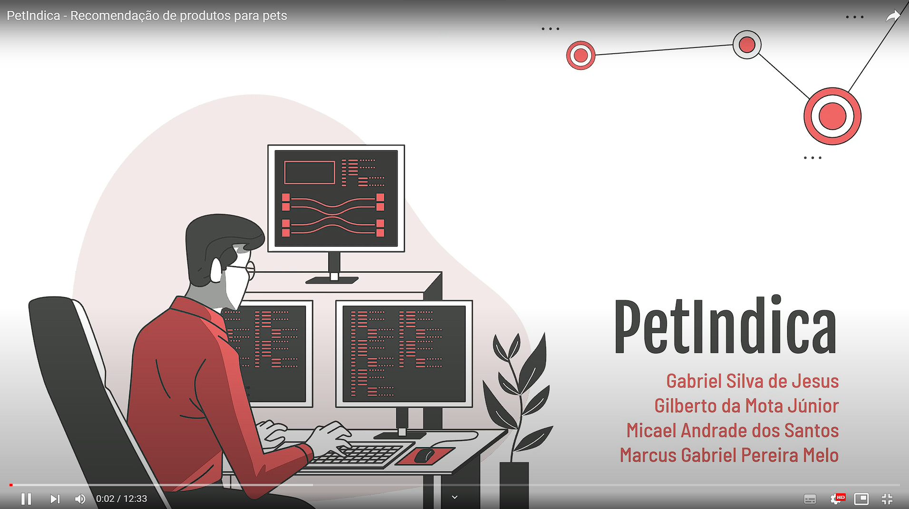
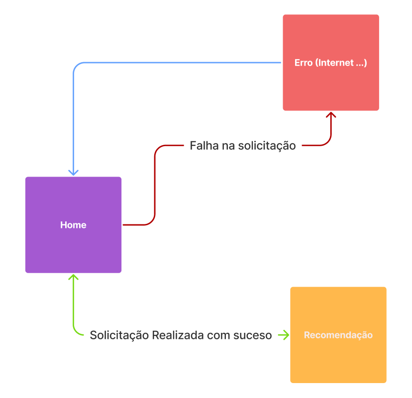
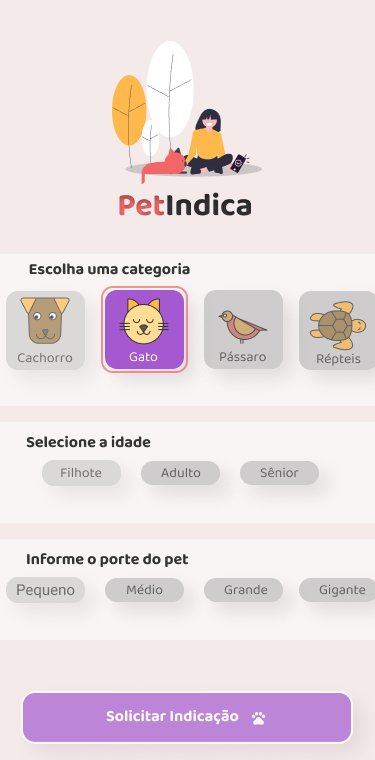
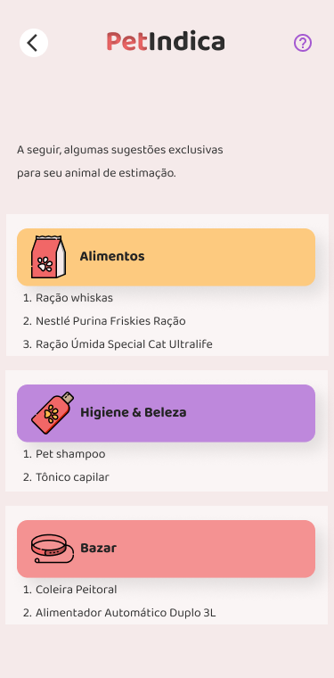
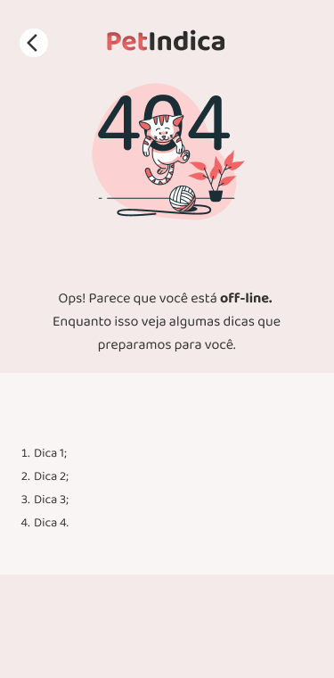
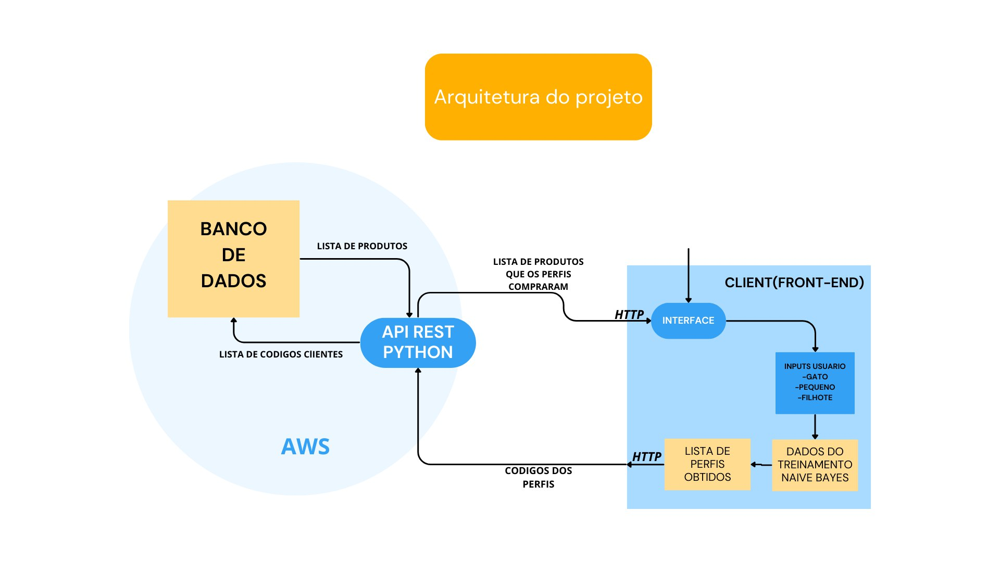

# [PetIndica](https://petindica.netlify.app/)

Projeto Final para disciplina de IA - UFS

  

> O PetIndica é um programa de computador via web que serve para recomendar produtos da área pet para possíveis clientes que ainda não sabem o que comprar ou que preferem ter um conselho mais refinado sobre indicações de produtos.

- [Prototipo no figma](https://www.figma.com/file/XypjyQvUThlPKbfAhi9Ulw/PetIndica?type=design&node-id=0%3A1&t=nPKN4ucsf6fl2eIe-1)

## :heavy_check_mark: Entregáveis

### :link: Acessar o projeto no Netlify

<a href="https://petindica.netlify.app/" target="_blank">PetIndica</a>

> :exclamation: Observação: Se por acaso o app der alguma instabilidade nas requisições, é só mandar um email ou me marcar no classroom com gabriel.btera@academico.ufs.br que verificamos.

### :clipboard: Doc de registro do software

> :heavy_exclamation_mark: Para o documento com os dados completo dos integrantes entrar em contato com micael.santos@dcomp.ufs.br

[:closed_book: Doc](./doc/Registro_De_Programa_De_Computador_%20PetIndica.docx)

### :movie_camera: Vídeo Demonstração

## :camera: UX Telas

Telas criadas no figma para elaboração do projeto.

    
  

    
    
    
  

## :computer: Arquitetura do projeto

    

## 🤝 Colaboradores

Agradecemos às seguintes pessoas que contribuíram para este projeto:

<table>
  <tr>
    <td align="center">
      <a href="https://github.com/kaellandrade">
         
        
          <b>Micael Andrade</b>
        
      </a>
    </td>
    <td align="center">
      <a href="https://github.com/biel0209">
         
        
          <b>Marcus</b>
        
      </a>
    </td>
    <td align="center">
      <a href="https://github.com/gibajunior18">
         
        
          <b>Gilberto</b>
        
      </a>
    </td>
    <td align="center">
      <a href="https://github.com/gabrielbtera">
         
        
          <b>Gabriel</b>
        
      </a>
    </td>
    <td align="center">
      <a href="https://github.com/hendrikdcomp/">
         
        
          <b>Hendrik</b>
        
      </a>
    </td>
  </tr>
</table>

## **Linguagens e Ferramentas utilizadas no projeto:**

## Ajustes e melhorias (Trabalhos futuros)

- Obter dados para classes de animais que não recebem nenhuma recomendação. Isso se deve ao fato de na nossa base não haver dados suficientes para aquelas características em específico. Como por exemplo **PASSÁRO -> GIGANTE -> ADULTO -> A nossa base de dados não tem nenhuma compra com essa categoria. Assim como outras.**
- No output, mostrar também imagens ilustrativas de cada produto.

## :closed_book: Referências

### Artigos

> P. Valdiviezo-Diaz, F. Ortega, E. Cobos and R. Lara-Cabrera, "A Collaborative Filtering Approach Based on Naïve Bayes Classifier," in IEEE Access, vol. 7, pp. 108581-108592, 2019, doi: 10.1109/ACCESS.2019.2933048. - Filtragem colaborativa

### UX inspirações

- [Undraw](https://undraw.co/)
- [Dribbble](https://dribbble.com/)

[⬆ Voltar ao topo](#PetIndica) 
