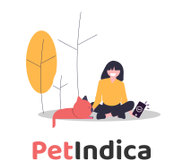

# PetIndica

Projeto Final para disciplina de IA - UFS

  

> O PetIndica é um programa de computador via web que serve para recomendar produtos da área pet para possíveis clientes que ainda não sabem o que comprar ou que preferem ter um conselho mais refinado sobre indicações de produtos. Acessar o projeto <a href="https://petindica.netlify.app/">PetIndica</a>

## :movie_camera: Vídeo Demonstração

Video do youtube aqui...

### Ajustes e melhorias (Trabalhos futuros)

Descrição aqui...

## :camera: UX Telas

<iframe style="border: 1px solid rgba(0, 0, 0, 0.1);" width="800" height="450" src="https://www.figma.com/embed?embed_host=share&url=https%3A%2F%2Fwww.figma.com%2Ffile%2FXypjyQvUThlPKbfAhi9Ulw%2FPetIndica%3Ftype%3Ddesign%26node-id%3D0%253A1%26t%3DnPKN4ucsf6fl2eIe-1" allowfullscreen></iframe>
Telas criadas no figma para elaboração do projeto.

## :computer: Arquitetura do projeto

## 🤝 Colaboradores

Agradecemos às seguintes pessoas que contribuíram para este projeto:

<table>
  <tr>
    <td align="center">
      <a href="https://github.com/kaellandrade">
         
        
          <b>Micael Andrade</b>
        
      </a>
    </td>
    <td align="center">
      <a href="https://github.com/biel0209">
         
        
          <b>Marcus</b>
        
      </a>
    </td>
    <td align="center">
      <a href="https://github.com/gibajunior18">
         
        
          <b>Gilberto</b>
        
      </a>
    </td>
    <td align="center">
      <a href="https://github.com/gabrielbtera">
         
        
          <b>Gabriel</b>
        
      </a>
    </td>
    <td align="center">
      <a href="https://github.com/hendrikdcomp/">
         
        
          <b>Hendrik</b>
        
      </a>
    </td>
  </tr>
</table>

## **Linguagens e Ferramentas utilizadas no projeto:**

<code></code>
<code></code>
<code></code>
<code></code>
<code></code>
<code></code>
<code></code>
<code></code>
<code></code>
<code></code>
<code></code>
<code></code>

[⬆ Voltar ao topo](#PetIndica) 
